layout: true

<div class="my-footer"><span>


</span></div> 

```{r setup, include=FALSE, cache=FALSE}
knitr::opts_chunk$set(echo = FALSE, fig.align = "center", message = FALSE, 
                      warning = FALSE, comment = "  #>", collapse = T, cache = FALSE )
```

```{r libs}
#toolbox
 if(!require("tidyverse")){install.packages("tidyverse", dependencies = T); library(tidyverse)}
#datasets
 if(!require("MASS")){install.packages("MASS", dependencies = T); library(MASS)}
 if(!require("BatchGetSymbols")){install.packages("BatchGetSymbols", dependencies = T); library(BatchGetSymbols)}
#views
 if(!require("skimr")){install.packages("skimr", dependencies = T); library(skimr)}
#graphs
 if(!require("viridis")){install.packages("viridis", dependencies = T); library(viridis)}
 if(!require("corrplot")){install.packages("corrplot", dependencies = T); library(corrplot)}
 if(!require("GGally")){install.packages("GGally", dependencies = T); library(GGally)}
 if(!require("plotly")){install.packages("plotly", dependencies = T); library(plotly)}
 if(!require("esquisse")){install.packages("esquisse", dependencies = T); library(esquisse)}
#graphs extra
 if(!require("gganimate")){install.packages("gganimate", dependencies = T); library(gganimate)}
 if(!require("gapminder")){install.packages("gapminder", dependencies = T); library(gapminder)}
 if(!require("highcharter")){install.packages("highcharter", dependencies = T); library(highcharter)}
```


<!-- R -->
---
class: center


```{r, out.width="25%", fig.cap="<center><b> </center></b>"}
knitr::include_graphics("img/R_logo.svg.png")
```


- O R é uma linguagem de programação, além de um ambiente de software gratuito. 

--

- oferece um vasto leque de funcionalidades acessíveis via instalação de bibliotecas.

--

- o R possui uma comunidade extremamente ativa, engajada desde o aprimoramento da ferramenta e desenvolvimento de novas bibliotecas, até o suporte aos usuários.

--

- Saiba mais em: [r-project.org](https://www.r-project.org/about.html) 


<!-- ciclo de ciência de dados sem R -->
---
class: middle

# O Ciclo da Ciência de Dados

```{r, out.width="70%", fig.cap="<center><b>Ilustração por Allison Horst - Twitter: <a href='https://twitter.com/allison_horst/'> @allison_horst</a> - (adaptado de Wickham & Grolemund, 2017</b></center>"}
knitr::include_graphics("img/allisonhorst/data-analysis_withoutR.png")
```


<!-- ciclo de ciência de dados com R -->
---
class: middle

# O Ciclo da Ciência de Dados

```{r, out.width="70%", fig.cap="<center><b>Ilustração por Allison Horst - Twitter: <a href='https://twitter.com/allison_horst/'> @allison_horst</a> - (adaptado de Wickham & Grolemund, 2017</b></center>"}
knitr::include_graphics("img/allisonhorst/data-analysis_withR.png")
```


<!-- communication 1 -->
---
class: middle

# Visualização de Dados

```{r, out.width="90%", fig.cap="<center><b> </center></b>"}

```


<!-- comunicação 2 -->
---
class: middle

# Visualização de Dados

```{r, out.width="90%", fig.cap="<center><b> </center></b>"}
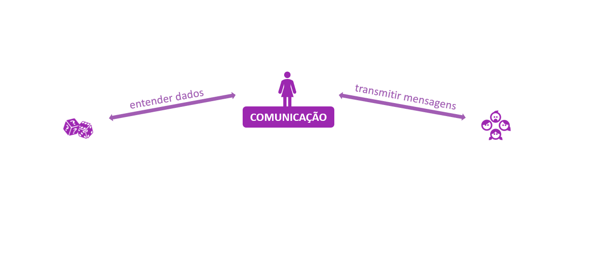
```


<!-- comunicação 3 -->
---
class: middle

# Visualização de Dados

```{r, out.width="90%", fig.cap="<center><b> </center></b>"}

```


<!-- comunicação 4 -->
---
class: middle

# Visualização de Dados

```{r, out.width="90%", fig.cap="<center><b> </center></b>"}
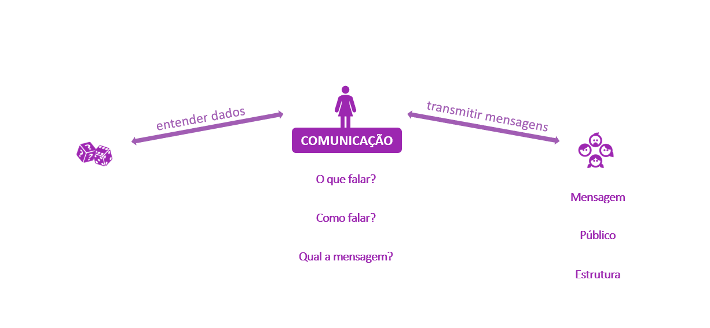
```


<!-- comunicação 5 -->
---
class: middle

# Visualização de Dados

```{r, out.width="90%", fig.cap="<center><b> </center></b>"}

```


<!-- comunicação 6 -->
---
class: middle

# Visualização de Dados

```{r, out.width="90%", fig.cap="<center><b> </center></b>"}
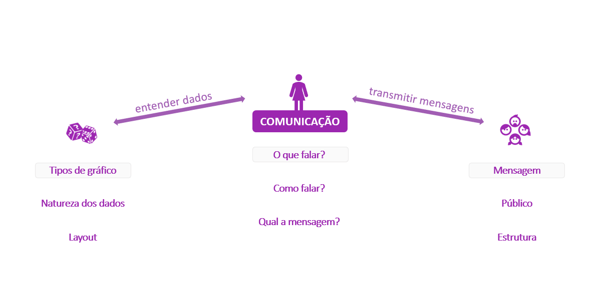
```


<!-- comunicação 7 -->
---
class: middle

# Visualização de Dados

```{r, out.width="70%", fig.cap="<center><b>Fonte: <a href='https://www.data-to-viz.com/'> Data to Viz</a> </b></center>"}
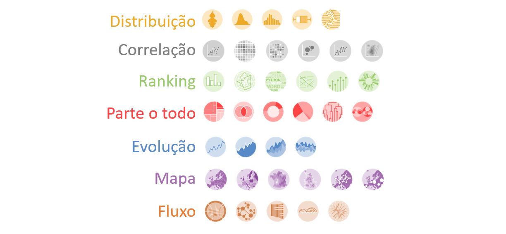
```


<!-- comunicação 8 -->
---
class: middle

# Visualização de Dados

```{r, out.width="90%", fig.cap="<center><b> </center></b>"}
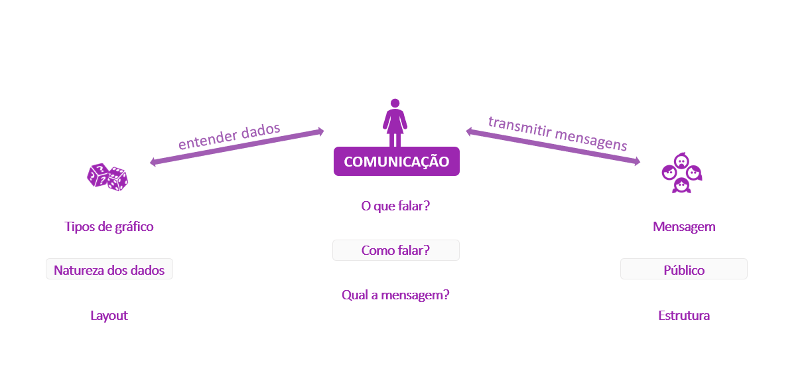
```


<!-- comunicação 9 -->
---
class: middle

# Visualização de Dados

```{r, out.width="60%", fig.cap="<center><b> </center></b>"}
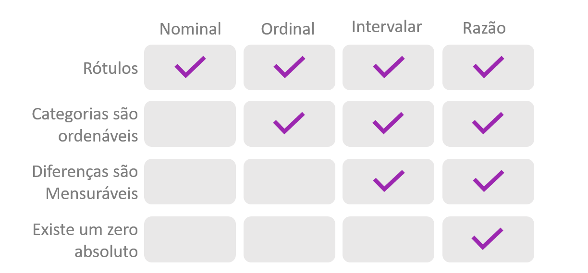
```


<!-- comunicação 10 -->
---
class: middle

# Visualização de Dados

```{r, out.width="90%", fig.cap="<center><b> </center></b>"}
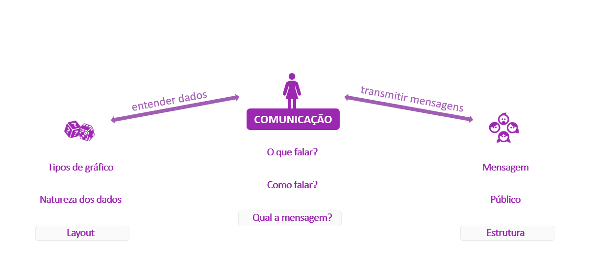
```


<!-- comunicação 11 -->
---
class: middle

# Visualização de Dados

```{r, out.width="80%", fig.cap="<center><b> </center></b>"}
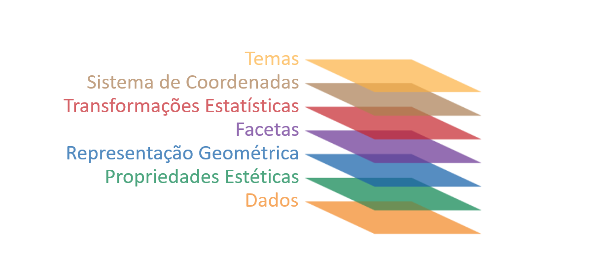
```

---
class: middle

# Gráficos além da comunicação dos resultados...


<!-- introdução ggplot -->
---
class: middle
```{r, echo=FALSE, message=FALSE, warning=FALSE, out.width="60%", fig.align='center'}
library(gridExtra)

texto <- c("Média de x: 9.0
       Variância de x: 11.0 
Média de y: 7.5
      Variância de y: 4.12
      Correlação entre x e y: 0.816
      R2: 0.666
      Reta de regressão linear: y= 3 + 0.5x")

gt1 <- ggplot(anscombe, aes(x1, y1)) +
  geom_blank()+
  theme_classic() +
  labs(
    title = "Dataset #1",
    x = "X 1",
    y = "Y 1")+
  geom_text(
    label=texto, 
    x=9,
    y=7.5,
    size = 4)+
  theme(axis.text.x = element_blank(), axis.ticks.x = element_blank())+
  theme(axis.text.y = element_blank(), axis.ticks.y = element_blank())
  
grid.arrange(gt1,gt1,gt1,gt1,nrow=2,ncol=2)


```

<!-- introdução ggplot -->
---

<!-- introdução ggplot -->
--- 

```{r, echo=FALSE, message=FALSE, warning=FALSE, out.width="60%", fig.align='center'}

d1 <- ggplot(anscombe, aes(x1, y1)) +
  geom_point() +
  theme_classic() +
  labs(
    title = "Dataset #1",
    x = "X 1",
    y = "Y 1") +
  geom_smooth(method = "lm", se = FALSE, col="red")

d2 <- ggplot(anscombe, aes(x2, y2)) +
  geom_point() +
  theme_classic() +
  labs(
    title = "Dataset #2",
    x = "X 2",
    y = "Y 2") +
  geom_smooth(method = "lm", se = FALSE, col="red")

d3 <- ggplot(anscombe, aes(x3, y3)) +
  geom_point() +
  theme_classic() +
  labs(
    title = "Dataset #3",
    x = "X 3",
    y = "Y 3") +
  geom_smooth(method = "lm", se = FALSE, col="red")

d4 <- ggplot(anscombe, aes(x4, y4)) +
  geom_point() +
  theme_classic() +
  labs(
    title = "Dataset #4",
    x = "X 4",
    y = "Y 4") +
  geom_smooth(method = "lm", se = FALSE, col="red")

grid.arrange(d1,d2,d3,d4,nrow=2,ncol=2)

```


---
class: middle

# Visualização de Dados + R = ggplot2

```{r, out.width="50%", fig.cap="<center><b>Ilustração por Allison Horst - Twitter: <a href='https://twitter.com/allison_horst/'> @allison_horst</a> </b></center>"}
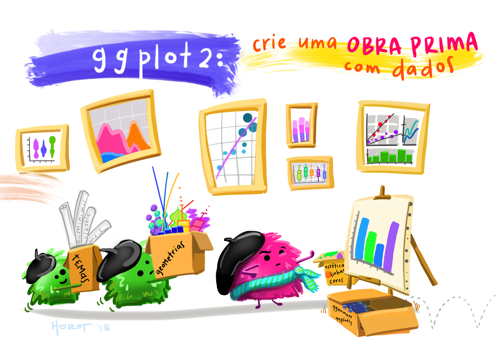
```


<!-- package ggplot -->
---
class: center

```{r, out.width="20%", fig.cap="<center><b> </center></b>"}
knitr::include_graphics("img/rlogos/hex-ggplot2.png")
```


- Faz com o mapeamento modular dos dados, seguindo uma lógica de camadas, similarmente ao encadeamento do Pipe (`%>%`) - porém utilizando o operador +

--

- Desenvolvida por [Hadley Wickham](http://hadley.nz/) durante a sua tese de doutorado, na Universidade de Iowa

--

- Inspirada no livro "The Grammar of Graphics" do Leland Wilkinson (1999) (daí o `gg` do `ggplot2`].

--

- Mantido pela [RStudio](https://rstudio.com/)


<!-- grammar of graphics + ggplot2 -->

---
class: middle

# Visualização de Dados 

```{r, out.width="90%", fig.cap="<center><b>Fonte: <a href='http://sape.inf.usi.ch/quick-reference/ggplot2'> sape research group </a></b></center>"}
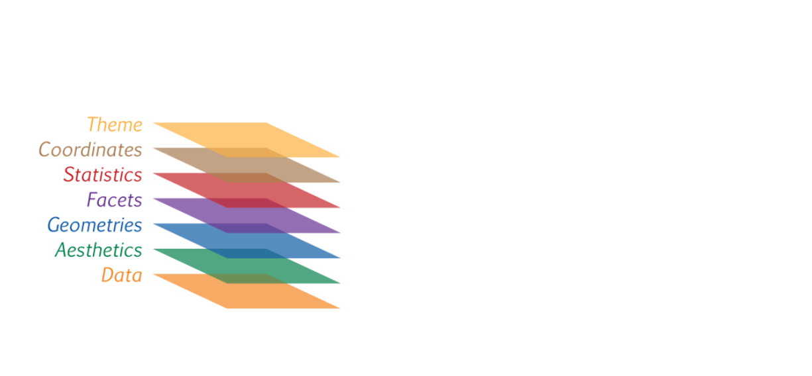
```


<!-- grammar of graphics + ggplot2 -->

---
class: middle

# Visualização de Dados + R = ggplot2 

```{r, out.width="90%", fig.cap="<center><b>Fonte: <a href='http://sape.inf.usi.ch/quick-reference/ggplot2'> sape research group </a></b></center>"}
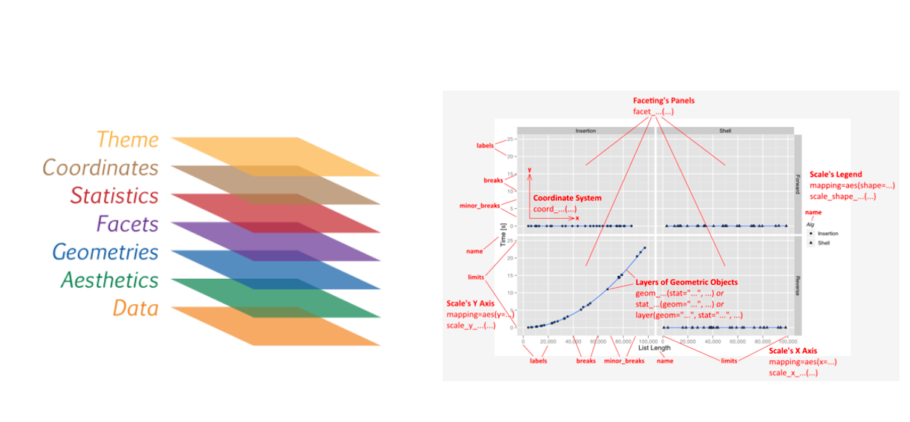
```


<!-- sintaxe básica do ggplot -->
---
class: middle

# Sintaxe Básica do ggplot2

```{r , echo=T, eval=F, results = 'markup', out.width="90%"}
  ggplot(data, aesthetics) +
    geometries()
```

```{r, out.width="80%", fig.cap=""}
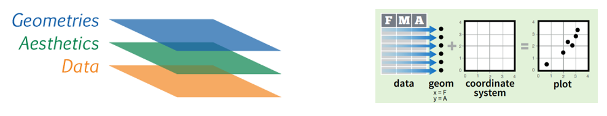
```


---
class: middle

# Sintaxe Básica do ggplot2

```{r , echo=T, eval=F, results = 'markup', out.width="90%"}
  ggplot(data, aesthetics) +
    geometries(statistics) +
    facets +
    coordinates +
    theme
```

```{r, out.width="80%", fig.cap=""}
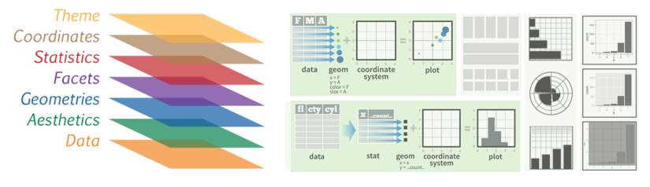
```


<!-- sintaxe básica do ggplot-1 -->
---
class: middle

# Sintaxe Básica do ggplot2
```{r , echo=T, out.width="90%", eval=F}
#Conjunto de bibliotecas para ciência de dados 
  install.packages("tidyverse")
  library(tidyverse)
```

```{r , echo=T, out.width="90%"}
dados <- tibble(var_x = 1:4, var_y = seq(2,8,2), var_grupo = c(rep("a", 3),"b")) 
summary(dados)
```


---
class: middle

# Sintaxe Básica do ggplot2

.left-code[

```{r plot-exemplo-ggplot-1-0, echo=T, fig.show="hide", collapse=T, comment = "  #>", out.width="90%"}
#exemplo
 ggplot(dados)
  
```
]

.right-plot[
`)
]


---
class: middle

# Sintaxe Básica do ggplot2

.left-code[

```{r plot-exemplo-ggplot-1-1, echo=T, fig.show="hide", collapse=T, comment = "  #>", out.width="90%"}
#exemplo
 ggplot(dados, aes(x = var_x, y = var_y)) 
  
```
]

.right-plot[
`)
]


---
class: middle

# Sintaxe Básica do ggplot2

.left-code[

```{r plot-exemplo-ggplot-1-2, echo=T, fig.show="hide", collapse=T, comment = "  #>", out.width="90%"}
#exemplo
 ggplot(dados, aes(x = var_x, y = var_y)) +
  geom_point()
  
```
]

.right-plot[
`)
]


<!-- sintaxe básica do ggplot-1-4 -->
---
class: middle

# Sintaxe Básica do ggplot2

.left-code[

```{r plot-exemplo-ggplot-1-4, echo=T, fig.show="hide", collapse=T, comment = "  #>", out.width="90%"}
#exemplo
 ggplot(dados) +
  geom_point(aes(x = var_x, y = var_y))
  
```
]

.right-plot[
`)
]


<!-- sintaxe básica do ggplot ggplot-1-5 -->
---
class: middle

# Sintaxe Básica do ggplot2

.left-code[

```{r plot-exemplo-ggplot-1-5, echo=T, fig.show="hide", collapse=T, comment = "  #>", out.width="90%"}
#exemplo
 ggplot(dados) +
  geom_point(aes(x = var_x, y = var_y, 
                 color = var_grupo))
  
```
]

.right-plot[
`)
]


<!-- sintaxe básica do ggplot-1-6 -->
---
class: middle

# Sintaxe Básica do ggplot2

.left-code[

```{r plot-exemplo-ggplot-1-6, echo=T, fig.show="hide", collapse=T, comment = "  #>", out.width="90%"}
#exemplo
 ggplot(dados, aes(x = var_x, y = var_y)) +
  geom_point(aes(color = var_grupo))
  
```
]

.right-plot[
`)
]


<!-- sintaxe básica do ggplot-1-6-1 -->
---
class: middle

# Sintaxe Básica do ggplot2

.left-code[

```{r plot-exemplo-ggplot-1-6-1, echo=T, fig.show="hide", collapse=T, comment = "  #>", out.width="90%"}
#exemplo
 ggplot(dados, aes(x = var_x, y = var_y, 
                   color = var_grupo)) +
  geom_point()
  
```
]

.right-plot[
`)
]


<!-- sintaxe básica do ggplot-1-7 -->
---
class: middle

# Sintaxe Básica do ggplot2

.left-code[

```{r plot-exemplo-ggplot-1-7, echo=T, fig.show="hide", collapse=T, comment = "  #>", out.width="90%"}
#exemplo
 ggplot(dados, aes(x = var_x, y = var_y, 
                   color = var_grupo)) +
  geom_point() +
  facet_grid(.~var_grupo)
  
```
]

.right-plot[
`)
]


<!-- sintaxe básica do ggplot-1-8 -->
---
class: middle

# Sintaxe Básica do ggplot2

.left-code[

```{r plot-exemplo-ggplot-1-8, echo=T, fig.show="hide", collapse=T, comment = "  #>", out.width="90%"}
#exemplo
 ggplot(dados, aes(x = var_x, y = var_y, 
                   color = var_grupo)) +
  geom_label(aes(label=var_x)) +
  facet_grid(.~var_grupo)
  
```
]

.right-plot[
`)
]


<!-- sintaxe básica do ggplot-1-9 -->
---
class: middle

# Sintaxe Básica do ggplot2

.left-code[

```{r plot-exemplo-ggplot-1-9, echo=T, fig.show="hide", collapse=T, comment = "  #>", out.width="90%"}
#exemplo
 ggplot(dados, aes(x = var_x, y = var_y, 
                   color = var_grupo,
                   label = var_x)) +
  geom_point() +
  geom_label() +
  facet_grid(.~var_grupo)
  
```
]

.right-plot[
`)
]


<!-- sintaxe básica do ggplot-1-10 -->
---
class: middle

# Sintaxe Básica do ggplot2

.left-code[

```{r plot-exemplo-ggplot-1-10, echo=T, fig.show="hide", collapse=T, comment = "  #>", out.width="90%"}
#exemplo
 ggplot(dados, aes(x = var_x, y = var_y, 
                   color = var_grupo,
                   label = var_x)) +
  geom_point() +
  geom_label() +
  facet_grid(.~var_grupo) +
  theme_dark()
  
```
]

.right-plot[
`)
]


<!-- sintaxe básica do ggplot-1-11 -->
---
class: middle

# Sintaxe Básica do ggplot2

.left-code[

```{r plot-exemplo-ggplot-1-11, echo=T, fig.show="hide", collapse=T, comment = "  #>", out.width="90%"}
#exemplo
 p <- ggplot(dados, aes(x = var_x, y = var_y, 
                   color = var_grupo,
                   label = var_x)) +
  geom_point() +
  geom_label() +
  facet_grid(.~var_grupo) +
  theme_dark()

  p + facet_grid(var_grupo~.)

  
```
]

.right-plot[
`)
]


<!-- aplicações -->
---
class: middle

# Aplicações


```{r, out.width="45%", fig.cap="<center><b>Ilustração por Allison Horst - Twitter: <a href='https://twitter.com/allison_horst/'> @allison_horst</a> </b></center>"}

```


<!-- Base de Dados Cars93 -->
---
class: middle

# Base de Dados Cars93
```{r , echo=T, out.width="90%", eval=F}
#Conjunto de bibliotecas para ciência de dados 
  install.packages("tidyverse")
  library(tidyverse)

#Pacote que contém base de dados Cars93
  install.packages("MASS")
  library(MASS)
```


```{r desc-exemplo-hist1, echo=TRUE, out.width="50%"}
df <- Cars93 %>% 
  select(Horsepower, Type, AirBags)

glimpse(df)
```


<!-- Base de Dados Cars93 + Histogram-->

---
class: middle

# Base de Dados Cars93

.left-code[
```{r plot-exemplo-hist1.1, echo=TRUE, fig.show="hide", out.width="90%"}
ggplot(df, aes(x = Horsepower)) 
```
]

.right-plot[
`)
]


---
class: middle

# Base de Dados Cars93 + Histograma

.left-code[
```{r plot-exemplo-hist2, echo=TRUE, fig.show="hide", out.width="90%"}
ggplot(df, aes(x = Horsepower)) +
  geom_histogram()
```
]

.right-plot[
`)
]


---
class: middle

# Base de Dados Cars93 + Histograma

.left-code[
```{r plot-exemplo-hist3, echo=TRUE, fig.show="hide", out.width="90%"}
ggplot(df, aes(x = Horsepower)) +
  geom_histogram(binwidth = 10)
```
]

.right-plot[
`)
]


---
class: middle

# Base de Dados Cars93 + Histograma

.left-code[
```{r plot-exemplo-hist3.1, echo=TRUE, fig.show="hide", out.width="90%"}
ggplot(df, aes(x = Horsepower)) +
  geom_histogram(binwidth = 10,
                 color = "black",
                 fill = "darkorchid4")
```
]

.right-plot[
`)
]


---
class: middle

# Base de Dados Cars93 + Histograma

.left-code[
```{r plot-exemplo-hist4, echo=TRUE, fig.show="hide", out.width="90%"}
ggplot(df, aes(x = Horsepower)) +
  geom_histogram(binwidth = 10,
                 color = "black",
                 fill = "darkorchid4") +
  theme_bw() 
```
]

.right-plot[
`)
]


---
class: middle

# Base de Dados Cars93 + Histograma

.left-code[
```{r plot-exemplo-hist4.1, echo=TRUE, fig.show="hide", out.width="90%"}
ggplot(df, aes(x = Horsepower)) +
  geom_histogram(binwidth = 10,
                 color = "black",
                 fill = "darkorchid4") +
  theme_bw() +
  labs(x = "Nome eixo x", 
       y = "Nome eiixo y", 
       title = "Título",
       subtitle = "Subtítulo",
       caption="Fonte de Dados")
```
]

.right-plot[
`)
]


---
class: middle

# Base de Dados Cars93 + Histograma

.left-code[
```{r plot-exemplo-hist5, echo=TRUE, fig.show="hide", out.width="90%"}
ggplot(df, aes(x = Horsepower)) +
  geom_histogram(bins = 10, 
                 color = "black", 
                 fill = "darkorchid4") +
  theme_bw() +
  labs(x = "Frequencia", 
       y = "Horsepower", 
       title = "Potencia")
```
]

.right-plot[
`)
]


<!-- Base de Dados Cars93 + Gráfico de Barras-->
---
class: middle

# Base de Dados Cars93 

.left-code[
```{r plot-exemplo-bar1, echo=TRUE, fig.show="hide", out.width="90%"}
ggplot(df, aes(x = Type))

```
]

.right-plot[
`)
]


---
class: middle

# Base de Dados Cars93 + Gráfico de Barras

.left-code[
```{r plot-exemplo-bar2, echo=TRUE, fig.show="hide", out.width="90%"}
ggplot(df, aes(x = Type)) +
  geom_bar()
```
]

.right-plot[
`)
]


---
class: middle

# Base de Dados Cars93 + Gráfico de Barras

.left-code[
```{r plot-exemplo-bar3, echo=TRUE, fig.show="hide", out.width="90%"}
ggplot(df, aes(x = Type)) +
  geom_bar(fill = "darkorchid4")
```
]

.right-plot[
`)
]


---
class: middle

# Base de Dados Cars93 + Gráfico de Barras

.left-code[
```{r plot-exemplo-bar5, echo=TRUE, fig.show="hide", out.width="90%"}
ggplot(df, aes(x = Type)) +
  geom_bar(fill = "darkorchid4") +
  labs(x = "Tipo de carro", y = "Contagem",
       title = "Tipo de carro") 
```
]

.right-plot[
`)
]


---
class: middle

# Base de Dados Cars93 + Gráfico de Barras

.left-code[
```{r plot-exemplo-bar5.1, echo=TRUE, fig.show="hide", out.width="90%"}
ggplot(df, aes(x = Type)) +
  geom_bar(fill = "darkorchid4") +
  labs(x = "Tipo de carro", y = "Contagem",
       title = "Tipo de carro") +
  theme_minimal()
```
]

.right-plot[
`)
]


---
class: middle

# Base de Dados Cars93 + Gráfico de Barras

.left-code[
```{r plot-exemplo-bar6, echo=TRUE, fig.show="hide", out.width="90%"}
ggplot(df, aes(x = Type)) +
  geom_bar(fill = "darkorchid4") +
  labs(x = "Tipo de carro", y = "Contagem",
       title = "Tipo de carro") +
  theme_minimal() +
  facet_grid( ~ AirBags)
```
]

.right-plot[
`)
]


---
class: middle

# Base de Dados Cars93 + Gráfico de Barras

.left-code[
```{r plot-exemplo-bar7, echo=TRUE, fig.show="hide", out.width="90%"}
ggplot(df, aes(x = Type, fill = AirBags)) +
  geom_bar(position = "dodge", 
               color = "black") +
  theme_minimal()
```
]

.right-plot[
`)
]


---
class: middle

# Base de Dados Cars93 + Gráfico de Barras

.left-code[
```{r plot-exemplo-bar7.1, echo=TRUE, fig.show="hide", out.width="90%"}
ggplot(df, aes(x = Type, fill = AirBags)) +
  geom_bar(position = "dodge", 
               color = "black") +
  theme_minimal() +
  scale_fill_brewer(palette = "Purples", 
                    direction = 1)
```
]

.right-plot[
`)
]


---
class: middle

# Base de Dados Cars93 + Gráfico de Barras

.left-code[
```{r plot-exemplo-bar8, echo=TRUE, fig.show="hide", out.width="90%"}
ggplot(df, aes(x = Type, fill = AirBags)) +
  geom_bar(position = "fill", 
               color = "black") +
  theme_minimal() +
  scale_fill_brewer(palette = "Purples", 
                    direction = 1)
```
]

.right-plot[
`)
]


---
class: middle

# Base de Dados Cars93 + Gráfico de Barras

.left-code[
```{r plot-exemplo-bar9, echo=TRUE, fig.show="hide", out.width="90%"}
ggplot(df, aes(x = Type, fill = AirBags)) +
  geom_bar(position = "stack", 
               color = "black") +
  theme_minimal() +
  scale_fill_brewer(palette = "Purples", 
                    direction = 1)
```
]

.right-plot[
`)
]


---
class: middle

# Base de Dados Cars93 + Gráfico de Barras

.left-code[
```{r plot-exemplo-bar10, echo=TRUE, fig.show="hide", out.width="90%"}
ggplot(df, aes(x = Type, fill = AirBags)) +
  geom_bar(position = "stack", 
               color = "black") +
  theme_minimal() +
  scale_fill_brewer(palette = "Purples", 
                    direction = 1) +
  coord_flip()
```
]

.right-plot[
`)
]


<!-- Base de Dados HairEyeColor + boxplot -->
---
class: middle

# Base de Dados HairEyeColor

```{r , echo=T, out.width="90%", eval=F}
#Conjunto de bibliotecas para ciência de dados 
  install.packages("tidyverse")
  library(tidyverse)
```


```{r desc-exemplo-bpt1, echo=TRUE, fig.show="hide", out.width="90%"}
dfhair <- data.frame(HairEyeColor)
glimpse(dfhair)
```


---
class: middle

# Base de Dados HairEyeColor + Boxplot

.left-code[
```{r plot-exemplo-bpt2, echo=TRUE, fig.show="hide", out.width="90%"}
ggplot(dfhair, aes(x = as.factor(Sex), y = Freq, 
                   fill = Sex)) +
  theme_minimal() +
  geom_boxplot()

```
]

.right-plot[
`)
]


---
class: middle

# Base de Dados HairEyeColor + Boxplot

.left-code[
```{r plot-exemplo-bpt2.1, echo=TRUE, fig.show="hide", out.width="90%"}
ggplot(dfhair, aes(x = as.factor(Sex), y = Freq, 
                   color = Sex)) +
  theme_minimal() +
  geom_boxplot() +
  scale_x_discrete(labels = c("Homem", "Mulher")) +
  xlab("Sexo") +
  ylab("Frequencia") +
  scale_color_manual(values = 
                       c("darkorchid4", "brown2"))

```
]

.right-plot[
`)
]


---
class: middle

# Base de Dados HairEyeColor + Boxplot

.left-code[
```{r plot-exemplo-bpt3, echo=TRUE, fig.show="hide", out.width="90%"}
ggplot(dfhair, aes(x = as.factor(Sex), y = Freq, 
                   color = Sex)) +
  theme_minimal() +
  geom_boxplot(
    outlier.colour = "black",
    outlier.shape = 8,
    outlier.size = 4
  ) +
  scale_x_discrete(labels = c("Homem", "Mulher")) +
  xlab("Sexo") +
  ylab("Frequencia") +
  scale_color_manual(values = 
                       c("darkorchid4", "brown2"))

```
]

.right-plot[
`)
]


---
class: middle

# Base de Dados HairEyeColor + Boxplot

.left-code[
```{r plot-exemplo-bpt4, echo=TRUE, fig.show="hide", out.width="90%"}
ggplot(dfhair, aes(x = as.factor(Sex), y = Freq, 
                   color = Sex)) +
  theme_minimal() +
  geom_boxplot() +
  geom_dotplot(
    binaxis = 'y',
    stackdir = 'center',
    dotsize = 1,
    binwidth = 2
  ) +
  scale_x_discrete(labels = c("Homem", "Mulher")) +
  xlab("Sexo") +
  ylab("Frequencia") +
  scale_color_manual(values = 
                       c("darkorchid4", "brown2"))

```
]

.right-plot[
`)
]


---
class: middle

# Base de Dados HairEyeColor + Boxplot

.left-code[
```{r plot-exemplo-bpt6, echo=TRUE, fig.show="hide", out.width="90%"}
ggplot(dfhair, aes(x = as.factor(Sex), y = Freq, 
                   color = Sex)) +
  theme_minimal() +
  geom_boxplot(
    outlier.colour = "black",
    outlier.shape = 8,
    outlier.size = 4
  ) +
  scale_x_discrete(labels = c("Homem", "Mulher")) +
  labs(
    title = "Boxplot",
    x = "Sexo",
    y = "Frequência",
    subtitle = "HairEyeColor"
  )
```
]

.right-plot[
`)
]


---
class: middle

# Base de Dados HairEyeColor + Boxplot

.left-code[
```{r plot-exemplo-bpt7, echo=TRUE, fig.show="hide", out.width="90%"}
ggplot(dfhair, aes(x = as.factor(Sex), y = Freq, 
                   fill = Sex)) +
  theme_minimal() +
  geom_boxplot(
    outlier.colour = "black",
    outlier.shape = 8,
    outlier.size = 4
  ) +
  scale_x_discrete(labels = c("Homem", "Mulher")) +
  labs(
    title = "Boxplot",
    x = "Sexo",
    y = "Frequência",
    subtitle = "HairEyeColor"
  ) +
  scale_fill_manual(values = 
                      c("darkorchid4", "brown2"))
```
]

.right-plot[
`)
]


<!-- Base de Dados mtcars + gráf dispersão -->
---
class: middle

```{r , echo=T, out.width="90%", eval=F}
#Conjunto de bibliotecas para ciência de dados 
  install.packages("tidyverse"); library(tidyverse)
```


# Base de Dados mtcars
```{r desc-exemplo-disp1, echo=TRUE, fig.show="hide", out.width="90%"}
data(mtcars)
glimpse(mtcars)
```


---
class: middle

# Base de Dados mtcars + Gráfico de Dispersão

.left-code[
```{r plot-exemplo-disp1, echo=TRUE, fig.show="hide", out.width="90%"}
ggplot(mtcars, aes(mpg, drat)) +
  geom_point()
```
]

.right-plot[
`)
]


---
class: middle

# Base de Dados mtcars + Gráfico de Dispersão

.left-code[
```{r plot-exemplo-disp2, echo=TRUE, fig.show="hide", out.width="90%"}
ggplot(mtcars, aes(mpg, drat)) +
  geom_point() +
  theme_classic() +
  labs(
    title = "Meu gráfico :)",
    subtitle = "Gráfico de Dispersão",
    x = "MPG",
    y = "Drat",
    caption = "Fonte de dados")
```
]

.right-plot[
`)
]


---
class: middle

# Base de Dados mtcars + Gráfico de Dispersão

.left-code[
```{r plot-exemplo-disp3, echo=TRUE, fig.show="hide", out.width="90%"}
ggplot(mtcars, aes(mpg, drat)) +
  geom_point(aes(size = drat)) +
  theme_classic() +
  labs(
    title = "Meu gráfico :)",
    subtitle = "Gráfico de Dispersão",
    x = "MPG",
    y = "Drat",
    caption = "Fonte de dados")
```
]

.right-plot[
`)
]


---
class: middle

# Base de Dados mtcars + Gráfico de Dispersão

.left-code[
```{r plot-exemplo-disp4, echo=TRUE, fig.show="hide", out.width="90%"}
ggplot(mtcars, aes(mpg, drat, colour = cyl)) +
  geom_point() +
  theme_classic() +
  labs(
    title = "Meu gráfico :)",
    subtitle = "Gráfico de Dispersão",
    x = "MPG",
    y = "Drat",
    caption = "Fonte de dados",
    colour="Cilindros")
```
]

.right-plot[
`)
]


---
class: middle

# Base de Dados mtcars + Gráfico de Dispersão

.left-code[
```{r plot-exemplo-disp5, echo=TRUE, fig.show="hide", out.width="90%"}
ggplot(mtcars, aes(mpg, drat)) +
  geom_point() +
  theme_classic() +
  labs(
    title = "Meu gráfico :)",
    subtitle = "Gráfico de Dispersão",
    x = "MPG",
    y = "Drat",
    caption = "Fonte de dados") +
  geom_vline(xintercept = 20, col="red") 
```
]

.right-plot[
`)
]


---
class: middle

# Base de Dados mtcars + Gráfico de Dispersão

.left-code[
```{r plot-exemplo-disp6, echo=TRUE, fig.show="hide", out.width="90%"}
ggplot(mtcars, aes(mpg, drat)) +
  geom_point() +
  theme_classic() +
  labs(
    title = "Meu gráfico :)",
    subtitle = "Gráfico de Dispersão",
    x = "MPG",
    y = "Drat",
    caption = "Fonte de dados") +
  geom_hline(yintercept = 4, col="red") 

```
]

.right-plot[
`)
]


---
class: middle

# Base de Dados mtcars + Gráfico de Dispersão

.left-code[
```{r plot-exemplo-disp7, echo=TRUE, fig.show="hide", out.width="90%"}
ggplot(mtcars, aes(mpg, drat)) +
  geom_point() +
  theme_classic() +
  labs(
    title = "Meu gráfico :)",
    subtitle = "Gráfico de Dispersão",
    x = "MPG",
    y = "Drat",
    caption = "Fonte de dados") +
  geom_vline(xintercept = 10:15, col="red") 

```
]

.right-plot[
`)
]


---
class: middle

# Base de Dados mtcars + Gráfico de Dispersão

.left-code[
```{r plot-exemplo-disp8, echo=TRUE, fig.show="hide", out.width="90%"}
ggplot(mtcars, aes(mpg, drat)) +
  geom_point() +
  theme_classic() +
  labs(
    title = "Meu gráfico :)",
    subtitle = "Gráfico de Dispersão",
    x = "MPG",
    y = "Drat",
    caption = "Fonte de dados") +
  geom_smooth(method = "lm", se = FALSE, col="red") 

```
]

.right-plot[
`)
]


---
class: middle

# Base de Dados mtcars + Gráfico de Dispersão

.left-code[
```{r plot-exemplo-disp9, echo=TRUE, fig.show="hide", out.width="90%"}
ggplot(mtcars, aes(mpg, drat)) +
  geom_point() +
  theme_classic() +
  labs(
    title = "Meu gráfico :)",
    subtitle = "Gráfico de Dispersão",
    x = "MPG",
    y = "Drat",
    caption = "Fonte de dados") +
  geom_smooth(method = "lm", se = TRUE, col="red")

```
]

.right-plot[
`)
]


<!-- Base de Dados XXX + Series Temporais-->
---
class: middle

# Base de Dados Ações

```{r , echo=T, out.width="90%", eval=F}
#Pacote que extrai dados do mercado de ações
install.packages("BatchGetSymbols")
library(BatchGetSymbols)
```

```{r, message=FALSE, warning=FALSE, echo=TRUE}
#Definindo ações para extração de dados
empresas <- c('PETR4.SA', 'CIEL3.SA')

#Definindo a minha série de tempo
first.date <- Sys.Date()-90
last.date <- Sys.Date()

#Inserindo os paramentros para extrair o meu dataframe
temp <- BatchGetSymbols(tickers = empresas,
                         first.date = first.date,
                         last.date = last.date, do.cache=FALSE)
```

---
class: middle

# Base de Dados Ações

```{r, echo=TRUE}
meudataset <- temp$df.tickers

glimpse(meudataset)
```

---
class: middle

# Base de Dados Ações + Series Temporais

.left-code[
```{r plot-exemplo-st1, echo=TRUE, fig.show="hide", out.width="90%"}
ggplot(meudataset, 
       aes(x = ref.date,
           y = volume)) +
  geom_line()
```
]

.right-plot[
`)
]

---
class: middle

# Base de Dados Ações + Series Temporais

.left-code[
```{r plot-exemplo-st2, echo=TRUE, fig.show="hide", out.width="90%"}
ggplot(meudataset, 
       aes(x = ref.date, 
           y = volume, 
           color = ticker)) +
  geom_line()
```
]

.right-plot[
`)
]


---
class: middle

# Base de Dados Ações + Series Temporais

.left-code[
```{r plot-exemplo-st3, echo=TRUE, fig.show="hide", out.width="90%"}
ggplot(meudataset, 
       aes(x = ref.date, 
           y = volume, 
           color = ticker)) +
  geom_line() +
  labs(
    title = "Série Temporal",
    subtitle = "Ações",
    x = "Data",
    y = "Volume de Ações",
    caption = "Fonte: Bovespa"
  ) +
  theme_minimal()
```
]

.right-plot[
`)
]

---
class: middle

# Base de Dados Ações + Series Temporais

.left-code[
```{r plot-exemplo-st4, echo=TRUE, fig.show="hide", out.width="90%"}
ggplot(meudataset, 
       aes(x = ref.date, 
           y = volume, 
           color = ticker)) +
  geom_line() +
  labs(
    title = "Série Temporal",
    subtitle = "Ações",
    x = "Data",
    y = "Volume de Ações",
    caption = "Fonte: Bovespa"
  ) +
  theme(legend.position = "bottom") +
  scale_x_date(date_breaks = "2 week")

```
]

.right-plot[
`)
]


<!-- Base de Dados XXX + Heatmap -->
---
class: middle


# Base de Dados Happy

```{r , echo=T, out.width="90%", eval=F}
#Extensão do ggplot2 para análises de correlação e base happy
  install.packages("GGally"); library(GGally)

#Pacote com paleta de cores otimizada
  install.packages("viridis"); library(viridis)
```

```{r desc-exemplo-heatmap, echo=TRUE, out.width="50%"}
glimpse(happy)
```


---
class: middle

# Base de Dados Happy + Heatmap

.left-code[

```{r plot-exemplo-heatmap1, echo=TRUE, fig.show="hide", out.width="90%"}
  happy %>% 
    count(age, year) %>% 
    ggplot(aes(age, year, fill = n)) +
      geom_tile() +
      scale_fill_viridis() 
```
]

.right-plot[
`)
]


---
class: middle

# Base de Dados Happy + Heatmap

.left-code[

```{r plot-exemplo-heatmap2, echo=TRUE, fig.show="hide", out.width="90%"}
  happy %>% 
    count(age, year) %>% 
    group_by(year) %>%
    mutate(total = sum(n),
           prop = n / total) %>%
    ggplot(aes(age, year, fill = prop)) +
      geom_tile() +
      scale_fill_viridis()
```
]

.right-plot[
`)
]


---
class: middle

# Base de Dados Happy + Heatmap

.left-code[

```{r plot-exemplo-heatmap3, echo=TRUE, fig.show="hide", out.width="90%"}
  happy %>% 
    drop_na(happy) %>% 
    count(age, year, happy) %>% 
    group_by(year, happy) %>%
    mutate(total = sum(n),
           prop = n / total) %>%
    ggplot(aes(age, year, fill = prop)) +
      geom_tile() +
      scale_fill_viridis() +
  facet_grid(.~happy)
```
]

.right-plot[
`)
]


<!-- mtcars + Correlagrama -->


---
class: middle

# Base de Dados mtcars + Correlagrama

.left-code[
```{r plot-exemplo-corr, echo=TRUE, fig.show="hide", out.width="90%"}
library(corrplot)

m <- cor(mtcars)
corrplot(m,method="circle")

corrplot(m, method = "color",
         addCoef.col = "black")
```
]

.right-plot[
`)
]


---
class: middle

# Base de Dados mtcars + Correlagrama

.left-code[
```{r plot-exemplo-corr0, echo=TRUE, fig.show="hide", out.width="90%"}
corrplot(m, method = "color",
         addCoef.col = "black")
```
]

.right-plot[
`)
]


<!-- Base de Dados mtcars + ggpairs -->

---
class: middle

# Base de Dados mtcars + Matriz de gráficos

.left-code[
```{r plot-exemplo-corr1, echo=TRUE, fig.show="hide", out.width="90%"}
mtcars %>% 
  ggpairs()
```
]

.right-plot[
`)
]


---
class: middle

# Base de Dados mtcars + Matriz de gráficos

.left-code[
```{r plot-exemplo-corr2, echo=TRUE, fig.show="hide", out.width="90%"}
mtcars %>% 
  select(drat:am) %>% 
  ggpairs()
```
]

.right-plot[
`)
]


---
class: middle

# Base de Dados mtcars + Matriz de gráficos

.left-code[
```{r plot-exemplo-corr3, echo=TRUE, fig.show="hide", out.width="90%"}
mtcars %>% 
  select(drat:am) %>% 
  mutate_at(c("vs", "am"), as_factor) %>% 
  ggpairs()
```
]

.right-plot[
`)
]


<!-- Base de Dados diamonds + plotly -->
---
class: middle

# Base de Dados Diamonds

```{r , echo=T, out.width="90%", eval=F}
#Extensão do ggplot2 para análises de correlação e base happy
  install.packages("plotly"); library(plotly)
```

```{r desc-exemplo-plotly, echo=TRUE, out.width="50%"}
set.seed(100)
d <- diamonds %>% filter(cut %in% c("Very Good", "Premium", "Ideal")) %>% sample_frac(0.05)
d %>% glimpse
```


---
class: middle

# Base de Dados Diamonds + plotly

```{r plot-exemplo-plotly, echo=TRUE, fig.height = 5,  fig.width = 6.5}
p <- ggplot(d, aes(x = carat, y = price)) +
  geom_point(aes(text = paste("Clarity:", clarity)), size = 4) +
  geom_smooth(aes(colour = cut, fill = cut)) + facet_grid(.~cut)
ggplotly(p)
```


<!-- ggplot-cheatSheet -->

---
class: middle

# Referência para o ggplot 

```{r, out.width="60%", fig.cap="<center><b>RStudio CheatSheets: <a href='https://www.rstudio.com/resources/cheatsheets'> ggplot2 </a> </b></center>"}
knitr::include_graphics("img/ggplot-cheatSheet-pt1.png")
```


---
class: middle

# Referência para o ggplot

```{r, out.width="60%", fig.cap="<center><b>RStudio CheatSheets: <a href='https://www.rstudio.com/resources/cheatsheets'> ggplot2 </a> </b></center>"}
knitr::include_graphics("img/ggplot-cheatSheet-pt2.png")
```


<!-- esquisse -->

---
class: middle

# Biblioteca Esquisse

```{r , echo=TRUE, fig.show="hide", out.width="90%", eval=F}
install.packages("esquisse")
library(esquisse)
```

```{r, out.width="50%", fig.cap="<center><b>Ilustração por Allison Horst - Twitter: <a href='https://twitter.com/allison_horst/'> @allison_horst</a> </b></center>"}
knitr::include_graphics("img/allisonhorst/R-for-better-ds.png")
```


<!-- Outras possibilidades gráficas -->
---
class: middle

# **Quais outras opções de pacotes para visualização de dados?**


<!-- gganimate1 -->
---
class: middle

# gganimate
```{r, echo=F, cache = TRUE,  out.width="50%"}

library(gganimate)
library(gapminder)
theme_set(theme_bw())

p <- ggplot(
  gapminder, 
  aes(x = gdpPercap, y=lifeExp, size = pop, colour = country)
  ) +
  geom_point(show.legend = FALSE, alpha = 0.7) +
  scale_color_viridis_d() +
  scale_size(range = c(2, 12)) +
  scale_x_log10() +
  labs(x = "PIB per capita", y = "Expectativa de vida (anos)")
p + transition_time(year) +
  labs(title = "Ano: {frame_time}")
```

<!-- gganimate2 -->
---
class: middle

# gganimate
```{r, echo=F, cache = TRUE,  out.width="50%"}

g <- ggplot(
  airquality,
  aes(Day, Temp, group = Month, color = factor(Month))
  ) +
  geom_line() +
  scale_color_viridis_d() +
  labs(x = "Day of Month", y = "Temperature") +
  theme(legend.position = "top")

g + 
  geom_point() +
  transition_reveal(Day)

```


<!-- Highcharter -->
---
class: middle

# Highcharter

```{r , echo=F, fig.show="hide", out.width="90%", eval=F}
# create interactive line chart
install.packages("highcharter")
library(highcharter)

# data science
install.packages("tidyverse")
library(tidyverse)
```


```{r, cache = T, fig.cap="", out.width="70%", fig.align='center'}
# prepare data
data(gapminder, package = "gapminder")

asia <- gapminder %>%
  filter(continent == "Americas") %>%
  dplyr::select(year, country, lifeExp)

# convert to long to wide format
plotdata <- spread(asia, country, lifeExp)

# generate graph
highchart() %>%
  hc_xAxis(categories = plotdata$year) %>%
  hc_add_series(name = "Brasil",
                data = plotdata$Brazil) %>%
  hc_add_series(name = "Argentina",
                data = plotdata$Argentina) %>%
  hc_add_series(name = "Paraguai",
                data = plotdata$Paraguay) %>%
  hc_add_series(name = "Uruguai",
                data = plotdata$Uruguay) %>%

  hc_title(text = "Expectativa de vida por País - Mercosul - 
           <center><b> Fonte: <a href='https://rkabacoff.github.io/datavis/Interactive.html'>Adaptado de Datavis with R </a></b></center>",
           margin = 20,
           align = "left",
           style = list(color = "steelblue")) %>%
  hc_subtitle(text = "1952 à 2007",
              align = "left",
              style = list(color = "#2b908f",
                           fontWeight = "bold")) %>%
  hc_credits(enabled = TRUE, # add credits
             text = "Gapminder Data",
             href = "http://gapminder.com") %>%
  hc_legend(align = "left",
            verticalAlign = "top",
            layout = "vertical",
            x = 0,
            y = 100) %>%
  hc_tooltip(crosshairs = TRUE,
             backgroundColor = "#FCFFC5",
             shared = TRUE,
             borderWidth = 4) %>%
  hc_exporting(enabled = TRUE)

```


<!-- shiny -->
---
class: middle

#Shiny

```{r, out.width="80%", fig.cap="<center><b>GIF: Demonstração de um <a href='https://humansofdata.atlan.com/2019/01/shiny-electricity-latrine-water-india/'>Shiny do humansofdata. </a> </b></center>"}

knitr::include_graphics("img/shiny_exemploMapa.gif")
```


<!-- leaflet -->
---
class: middle

# Leaflet + Shiny

```{r, out.width="80%", fig.cap="<center><b>GIF: Demonstração de um <a href='http://shiny.rstudio.com/gallery/superzip-example.html'>Shiny do Super Zip Explorer</a> </b></center>"}

knitr::include_graphics("img/shinyleaflet.gif")
```

<!-- leaflet -->
---
class: center, middle

## Todos os slides foram feitos no Rmarkdown!


---

<!-- agradecimentos -->
--- 


```{r, out.width="40%", fig.cap="<center><b>Ilustração por Allison Horst - Twitter: <a href='https://twitter.com/allison_horst/'> @allison_horst</a> </b></center>"}
knitr::include_graphics("img/allisonhorst/community1.jpg")
```


---
class:  center, middle

# Obrigada!

